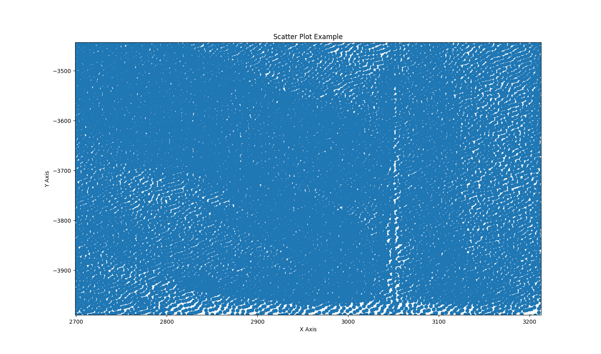
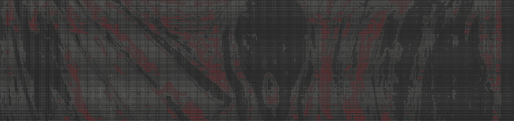

# PCAP Challenge
**WARNING**: Contains spoilers!!!

## History
I got the inspiration for this from a PCAP challenge I saw at a previous Sharkfest. Sake brought it to the event and (IIRC) it was created by Eddi. That challenge resulted in a dot-matrix style printed message when graphed. (If I can find that PCAP or a picture of the answer/result I will post it here) That PCAP got me thinking, 'we dont just have to use minimal points on a graph to display a message, instead we can create 1000's of points as a scatter plot style to display an image with shading and organic curves'.

I decided on "The Scream" as the art I was going to embed, as I felt like that should be the expression on your face when you finally got end-result using Wireshark. I wanted people to take-away from this challenge: "I never thought anything like that was even possible". I wanted to go beyond the typical PCAP CTF where you hunt for a hidden string amoung packets(I'm guilty of create many of these myself... still fun but not what I wanted this time), instead I wanted to demonstrate Wiresharks limitless capabilities and marvelous utility.

So, I got this idea but how to make it happen? I started on the journey to create this challenge a few times but fizzled out as my freetime was expiring, or I was getting stuck.

## AI Fail :(
Many times I asked ChatGPT after uploading an image of The Scream, "convert this image to a scatter plot and provide me with a CSV of coordinates of each point", "recreate this image using only points as dots, in a dot-matrix style rendering of this image", etc... and many more fails.

## Moar AI Fail
So I switched my methodology (prompt engineering). I started to ask ChatGPT to write me some python code to convert an image to ascii art, which is successfully did but there were little issues that made it unusable for my purpose. I guess I could've embeded the ascii text in packets and created a different challenge but its not what I wanted at the time.
 - Scaling was off

**NOTE:** I had to do some serious image resizing to make this below screenshot anything that resembles The Scream.

**RAW Text Files Here:**
 - [the_scream_ascii.txt](the_scream_ascii.txt)
 - [the_scream_ascii.old.txt](the_scream_ascii.old.txt)
 - [the_scream_ascii.old2.txt](the_scream_ascii.old2.txt)

